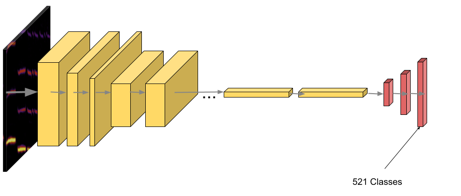
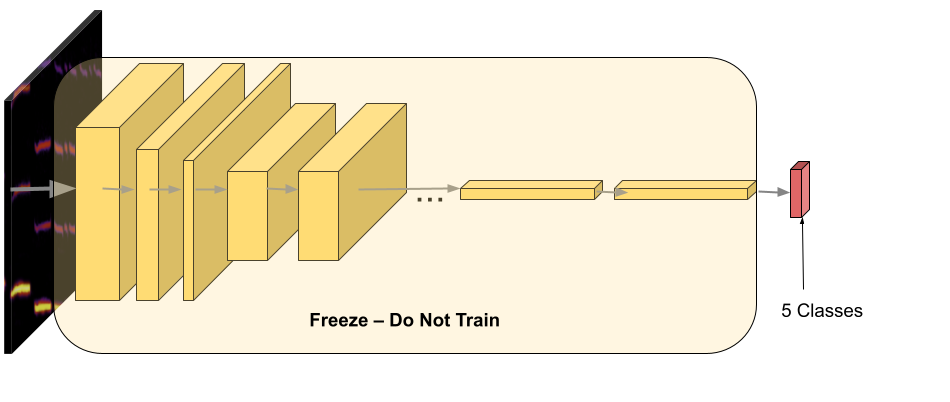

# Customizing an Audio Classification Model

## Overview
Machine learning models like [YAMNet](https://tfhub.dev/google/yamnet/1) are pre-trained to classify a wide range of audio events. However, when your task requires more specific audio classes, transfer learning allows you to adapt a pre-trained model to your needs without training from scratch.

## Transfer Learning with YAMNet
Transfer learning reuses the learned features from a large dataset to classify a smaller, more specific set of classes. YAMNet, trained on over 2 million audio events, can be adapted by freezing its pre-learned layers and adding a new classification head for your target classes.

## Prepare Data
To train your custom model, you need a dataset with labeled audio clips. You can download audio data from [AudioSet](https://research.google.com/audioset/) using [AudioSet-downloader](https://github.com/swagshaw/audioset-downloader) or record your own 10-second clips using PyAudio. The script for recording audio is provided in the accompanying notebook.

## Model Architecture
YAMNet is composed of convolutional layers followed by dense layers for classification. In transfer learning, the pre-trained layers are frozen, and a new classification head is added with the target classes.

After adaptation, the new architecture looks like this:

## Challenges in Audio Processing
Audio data has specific characteristics like sample rate, channels, and bit depth that impact model quality. When using YAMNet, ensure your audio files are mono channel with a 16 kHz sample rate. Downsampling may be required if your audio files have a higher sample rate.

## Next Steps
After preparing your data and modifying the model, you can proceed to training. The notebook provides detailed steps and code to help you customize and train your model effectively.

# Results
The result of this notebook is a model that works in harmony with yamnet, takes the embeddings provided by yamnet and predict more accuratly the classes trained on.

Training data is not provided with this notebook, only recorded data of the robot moving is provided.

to achieve better accuracy in classification in real-time, more training data should be provided and equally distributed for the classes.
 ### Contact 
 For any issues or questions, please contact me via:

- **Email**: soulirayen@gmail.com
- **LinkedIn**: [Rayen Souli](https://www.linkedin.com/in/rayen-souli/)